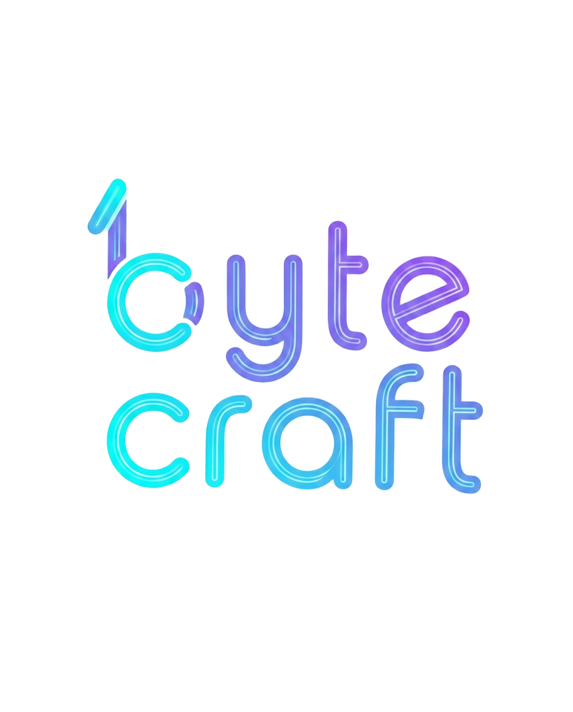

# 🚀 ByteCraft Coordinator Workplace & Platform

A modern, full-stack club management and sprint coordination platform tailored for the **ByteCraft** engineering and tech club at ESTIN.



---

## ✨ Features

- **🎯 Simple & Streamlined Dashboard**:
  - Live task checklist sorted automatically by deadline proximity.
  - Interactive 1-click status checking for assigned tasks.
  - Urgent deadline alerts (`Overdue`, `Due Today`, `Due Soon`).
  - Upcoming event preparation tracking and countdowns.
  - Personalized greetings, live date, and role badges.

- **🔒 Role-Based Scoping & Security**:
  - **Coordinators**: Full organization overview, manager visibility control, team radar telemetry, and workload distribution.
  - **Managers**: Scoped view strictly for their department's deadlines and tasks. Managers can only check and complete tasks assigned to them.
  - **Communication Department**: Dedicated Communication Campaign Hub for social media schedules, press releases, and announcements.

- **📅 Calendar & Agenda**:
  - Unified club agenda with sprint milestones, workshops, and meeting logs.
  - Filterable by department and event tags.

- **👥 Team & Member Management**:
  - Cloudinary-ready avatar photo uploads with local preview fallback.
  - Responsibilities tracking, contact links, and department assignment.

- **📱 Fully Responsive**:
  - Mobile-first layout with smooth slide-out navigation and responsive stat grids.

---

## 🛠️ Tech Stack

- **Frontend**:
  - React 19 + TypeScript
  - Vite 8
  - Lucide React Icons
  - Canvas Confetti
  - Vanilla CSS design tokens with Anime/Sky aesthetics

- **Backend**:
  - Node.js + Express
  - WebSocket (ws) real-time event synchronization
  - JWT Authentication + bcryptjs
  - File-based JSON database engine

---

## 🚀 Getting Started

### 1. Prerequisites
- Node.js (v18+)
- npm or pnpm

### 2. Backend Setup
```bash
cd server
npm install
npm run dev
```
*Server runs on `http://localhost:5000`.*

### 3. Frontend Setup
```bash
cd client
npm install
npm run dev
```
*Client runs on `http://localhost:5174`.*

---

## 🔑 Demo Access

All pre-seeded demo accounts share the password: `bytecraft2026`

- **Aya Karou** (`a_karou@estin.dz`) — Coordinator
- **Elmouatez Ledjassa** (`e_ledjassa@estin.dz`) — President / Coordinator
- **Manel Lyazidi** (`m_lyazidi@estin.dz`) — PR & Communication Manager
- **Imene Bouchareb** (`i_bouchareb@estin.dz`) — PR & Communication Manager
- **Imene Bouzena** (`i_bouzena@estin.dz`) — Design Manager
- **Mohammed Benkerri** (`mbenkerri44@gmail.com`) — Multimedia Manager
- **Lina Zaouani** (`l_zaouani@estin.dz`) — Multimedia Manager
- **Rayane Alem** (`r_alem@estin.dz`) — Activities & Logistics Manager
- **Yassine Bouguerra** (`y_bouguerra@estin.dz`) — Technical & Development Manager

---

## 📄 License
ByteCraft Coordination System © 2026–2027. Built with care for ByteCraft creators and engineers.
